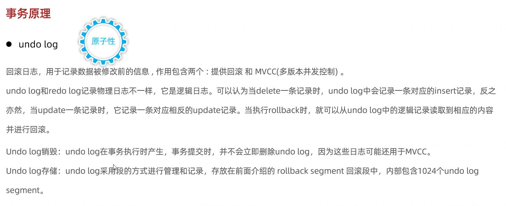

## 逻辑存储结构

- **表空间(Tablespace)：idb文件**，一个mysql实例可以对应多个表空间，用于存储数据和索引
- **段(Segment):** 分为数据段(数据)、索引段(索引)、回滚段(事务)，InnoDB是索引组织表，数据段是B+树的叶子节点，索引段是B+树的非叶子节点，回滚段用于事务的回滚和MVCC。段用来管理多个区extent。
- **区(Extent)：** 每个区的大小为1M。默认情况下，InnoDB存储引擎页大小为16KB，每个区可以存储64个连续的页。
- **页(Page)：** 默认大小16k，是InnoDB存储引擎磁盘管理的最小单位。为了保证页的连续性，InnoDB存储引擎一次从磁盘申请4-5个区extent。
- **行(Row)：** 行是表中实际的数据记录。

## 架构
左为内存结构，右为磁盘结构

### 后台线程

- **Master Thread**：负责将缓冲池(Buffer Pool)中的数据异步刷新到磁盘，保证数据的一致性。
- **IO Thread**：负责读取磁盘数据到缓冲池(Buffer Pool)。
- **Purge Thread**：负责清除缓冲池(Buffer Pool)中删除的数据，释放缓冲池空间。
- **Page Cleaner Thread**：负责将缓冲池(Buffer Pool)中脏页异步刷新到磁盘。

## 事务原理
- 事务的特性：ACID

  - **A(Atomicity)原子性：** 
  
      事务是一个不可分割的工作单位，事务中的操作，要么都发生，要么都不发生。**InnoDB通过使用事务日志（Redo Log）来实现原子性。** 在事务执行期间，它将所有操作记录到事务日志中，只有在所有操作都成功完成后，事务才会被标记为“已提交”。
  - **C(Consistency)一致性：** 
  
    事务前后数据的完整性必须保持一致。**InnoDB通过使用回滚段（Undo Log）来实现一致性**。如果在事务中某个操作失败，回滚段中的数据将被用来恢复到事务之前的状态，以保证数据库的一致性。
  - **I(Isolation)隔离性：** 
    
    事务的隔离性是指一个事务的执行不被其他事务干扰，各事务之间相互隔离。**InnoDB使用各种锁和多版本并发控制（MVCC）机制来实现隔离性**。这允许每个事务看到的数据是与其他事务隔离的，避免了数据争用和干扰。
  - **D(Durability)持久性：** 
  
    确保一旦事务提交，其结果将永久保存，即使发生系统故障也不会丢失。**InnoDB通过将事务日志写入磁盘来实现持久性**。即使数据已经写入内存，但在提交之前，相关操作将先被记录到事务日志，以确保即使发生故障，数据仍然可以从日志中恢复。

### redo log
redolog记录的是数据页的物理修改，用来实现事务的持久性。

该日志文件由两部分组成：
- 内存中的日志缓冲（redolog buffer）：在内存中
- 磁盘上的日志文件（redolog file）：在磁盘里

当事务提交后会把所有修改信息写入到redolog buffer，然后master thread 会把redolog buffer中的数据刷新到redolog file，用于刷新脏页到磁盘的这个过程发生错误时，进行数据恢复。

当数据在数据库中改变时，变化首先发生在buffer pool中，同时这些变化会被记录在`内存中`的重做日志缓冲区中。`脏页`是隔一段时间以一定的频率刷新到磁盘中，但是`重做日志缓冲区到磁盘上的重做日志文件的刷新`是在当事务成功完成并准备提交时就立即发生的。如果系统崩溃，数据库可以利用重做日志重新执行事务的变化，确保数据在故障后能够恢复到最新状态。

### undo log

- 数据回滚
- MVCC

## MVCC - 多版本并发控制
### 概念

### 实现
#### 记录中的隐式字段

DB_TRX_ID: 64位事务id，当前事务id，如果当前事务id为0，表示没有事务正在进行
DB_ROLL_PTR: 回滚指针，指向当前行记录的上一个版本(undo log)
DB_ROW_ID: 64位行id，主键id,没有指定主键时会生成该隐藏字段

#### undo log

#### readview

