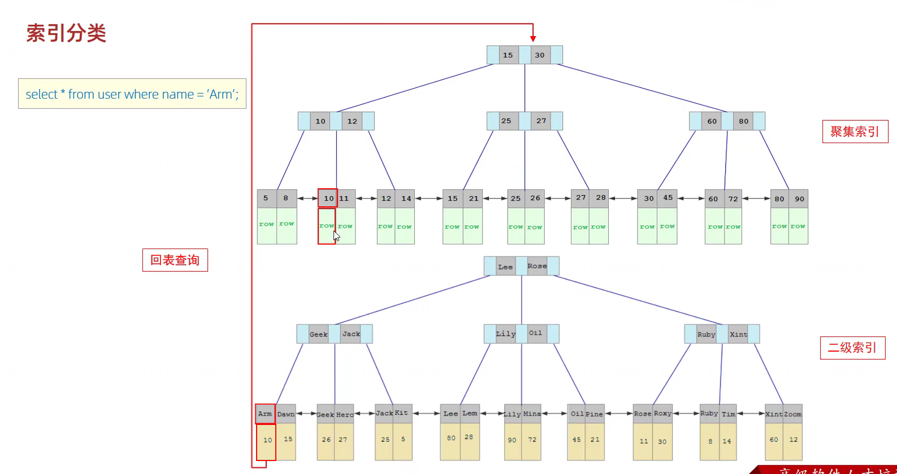

**索引概述**
高效获取数据的一种数据结构

**索引结构**
- Hash
- B+树

**为什么InnoDB使用B+树作为索引结构?**

B+树是B树的一种变形，B+树的非叶子节点只包含键值和索引，而不包含实际数据。
B+树索引的叶子节点包含了键值和指向实际数据的指针，叶子节点之间用指针相连，所有的叶子节点组成一个
树链表。
- 相对于二叉树，层级更少，搜索效率高；
- 对于B树，无论是叶子节点还是非叶子节点，都会保存数据，这样导致一页中能保存的键值数量变少，指针跟着减少，如果要保存的键值数量变多，则需要更多的树层，导致查询的IO次数变多，查询效率变低；而B+树只有叶子节点保存数据，非叶子节点不保存数据，这样能保存的键值数量变多，指针变少，树层少，查询的IO次数变少，查询效率变高。
- 相对于Hash索引，B+树支持范围查询和排序操作。

**索引分类**
1. 分类方式一
- 主键索引
- 唯一索引
- 常规索引 
- 全文索引
2. 分类方式二
- 聚集索引：默认主键，如果没有主键，则为第一个唯一索引作为主键，没有唯一索引，则创建一个隐藏的索引
- 二级索引

**InnoDB中，根据索引的存储形式，又可以分为：**
- **聚集索引（clustered index）**：必须有，而且只有一个
InnoDB 默认将主键索引设计为聚簇索引，索引结构的叶子节点保存了`行数据`。将数据与索引放在一起，B+ 树的有序性使得聚簇索引在查询性能方面非常高效，尤其是对于单一值查询。
- **二级索引（secondary index）**：可以存在多个
将数据与索引分开存储，索引结构的叶子节点关联的是`对应的数据的主键`。



**索引语法**

- **创建索引**
```sql
CREATE INDEX index_name ON table_name(column_name);
```
- **查看索引**
```sql
SHOW INDEX FROM table_name;
```
- **删除索引**
```sql
DROP INDEX index_name ON table_name;
``` 

**SQL性能分析**
- 执行频次
- 慢查询日志
- profile
- explain

- **EXPLAIN**
```sql
EXPLAIN SELECT * FROM table_name;
```

explain执行计划各字段含义:

    - **id**：select的序列号，id相同，执行顺序从上到下；id不同，id值越大优先级越高，越先执行。

    - **select_type**：查询类型，simple、primary、union、dependent、union result

    - **table**：查询表名

    - **type**：查询表的连接类型(`性能从差到好`)：all、index、range、ref、eq_ref、const、system、NULL

    - **possible_keys**：可能使用的索引

    - **key**：实际使用的索引
    - **key_len**：索引长度
    - **ref**：索引的列
    - **rows**：扫描行数
    - **Extra**：额外信息

- **SHOW PROFILE FOR XXX或者SHOW PROFILES**
```sql
SHOW PROFILE FOR QUERY 1;
```

**索引使用**
- 最左前缀法则

    如果索引了多列（联合索引），要遵循最左前缀法则。指的是查询从索引的最左列开始，并且不跳过索引中的列。如果不包含最左列，则索引全部失效；如果跳跃某一列，索引将部分失效（后面的字段的索引失效）。

    - e.g.: 

    有一个索引是(a,b,c)，
    则explain selet * from tb_user where a=1 and b=2 and c=3; 这样是走索引的。
    explain select * from tb_user where a=1 and c=3; 这样是走部分索引的(由于跳过了b列，所以直走a的索引)。
    explain select * from tb_user where b=2 and c=3; 这样是不走索引的(没有最左列，所以无法用联合索引)。

- 范围查询

    联合索引中，如果出现范围查询（大于或小于），则**范围查询右侧的列索引失效**。规避的方法：用>=代替>,小于同理。

- 索引列运算

    不要再索引列上进行运算操作，**否则索引将失效**。

- 字符串不加单引号

    字符串类型不加单引号，索引失效。

- 模糊查询
    
    如果仅仅是尾部进行模糊匹配，索引不会失效；如果是头部模糊匹配，则索引失效。

- or连接的条件

    如果or连接的条件，如果or前的条件中的列有索引，而后面的列中没有索引，那么涉及的索引都不会被用到。

- 数据分布影响
    
    如果mysql评估使用索引比全表更慢，则不适用索引。

- SQL 提示

    是优化数据库的一个重要手段，即在SQL语句中加入一些人为的提示来达到优化操作的目的。
    - use index
        use index 建议mysql使用一个索引，而不是使用该表的其它索引或全表扫描。
    - ignore index
        ignore index 提示mysql忽略一个索引，使用其它索引或全表扫描。
    - force index
        force index 强制mysql使用一个索引，而不是使用该表的其它索引或全表扫描。
    - 语法：
    ```sql
    select * from table_name force index(index_name);;
    ```

- 覆盖索引

    尽量使用覆盖索引（查询使用了索引，并且需要返回的列在该索引中国已经全部能够找到），减少使用select *，否则需要回表查询

- 前缀索引

    对于字符串类型(text varchar)的字段，有时候需要索引很长的字符串，这会让索引变得很大，查询时浪费大量的磁盘IO，永祥查询效率。此时可以只将字符串的一部分前缀建立索引，可以大大降低索引的大小，从而提高效率。
    - 语法：
    ```sql
    create index index_name on table_name(column_name(prefix_length));
    ```
    - 前缀长度：
    可以根据索引的选择性来决定，选择性越高，索引就越好。选择性是指：不重复的索引值和记录总数的比值，索引的选择性越高则查询效率越高，唯一索引的选择性是1。
    ```sql
    select count(distinct column_name) / count(*) from table_name;
    select count(distinct substring(column_name,1,5)) / count(*) from table_name;  -- 前缀长度为5
    ```

- 单列索引和联合索引
  
    如果涉及到多列数据的查询时，推荐使用联合索引


**索引设计原则**
- 针对数据量较大、且查询比较频繁的表建立索引
- 针对常作为查询条件(where)、排序(order by)、分组(group by)操作的字段建立索引
- 尽量使用联合索引，而少使用单列索引
- 尽量选择区分度高的列作为索引，如性别不能作为索引，而年龄、身份证号可以作为索引
- 如果是字符串类型的字段，字段的长度较长，建议创建前缀索引
- 控制索引的数量，并不是索引越多越好，索引越多，维护索引结构的代价越大，影响查询的性能，并且需要占用更多的磁盘空间
- 如果索引列不能存储NULL值，可以在创建表时用NOT NUL来约束它，优化器知道每列是否包含null值时，可以更好地确定那个索引最有效地用于查询


