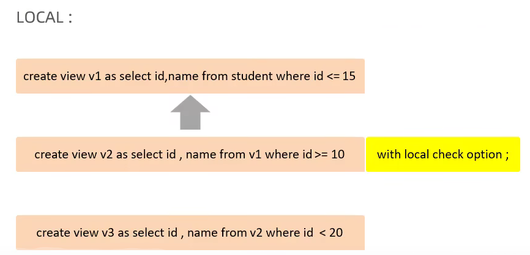

## 视图
**创建视图**
```sql
CREATE [OR REPLACE] VIEW view_name AS
SELECT column1, column2, ...
FROM table_name
WHERE condition
[with cascaded|local check option]
```

**查询视图**
```sql
SELECT *
FROM view_name
```

**修改视图**
- 方法一：
```sql
CREATE OR REPLACE VIEW view_name AS
SELECT column1, column2, ...
FROM table_name
WHERE condition
```
- 方法二：
```sql
alter VIEW view_name AS
SELECT column1, column2, ...
FROM table_name
WHERE condition
```

**删除视图**
```sql
DROP VIEW [if exists] view_name
```


**视图的检查选项**
- 检查选项：
    - 当使用with check option子句创建视图时，Oracle数据库会在视图上自动创建一个检查选项，这个检查选项决定在视图上执行DML操作时，Oracle数据库是否检查基表中数据是否满足`视图定义`的条件;
    - mysql允许基于另一个视图创建视图，他还会检查依赖视图中的规则以保持视图的一致性;
    - 视图的检查选项有：
        - 1.CASCADED（默认）：级联，要求更新后的数据以及所有嵌套视图和子查询都满足视图的条件。
        
        - 2.LOCAL：仅要求更新后的数据满足当前视图的条件。
        

**视图的作用**
- 1.简单：视图不仅可以简化用户对数据的理解，也可以简化用户对数据的操作。
- 2.安全：通过视图用户只能查询和修改他们所能操作的数据，数据库管理员可以对视图的访问权限进行控制
- 3.数据独立：视图的定义与数据是独立的，视图可以帮助用户屏蔽真实表结构变化带来的影响


## 存储过程
- 存储过程：数据库SQL语言层面的代码封装和重用。
- 存储过程基本语法
    - 1.创建存储过程
    ```sql
    create [or replace] procedure 存储过程名(参数列表)
    is/as
    变量声明语句;
    begin
      sql语句
    end;
    ```
    - 2.调用存储过程
    ```sql
    call 存储过程名(参数列表);
    ```
    - 3.查看存储过程
    ```sql
    show create procedure 存储过程名;
    ```
    - 4.删除存储过程
    ```sql
    drop procedure 存储过程名;
    ```

**变量**
- 系统变量: global/session
- 用户变量: 用户变量的名称以 @ 开头。 
```sql
set @变量名 := 变量值;
-- 或者
select @变量名 := 变量值;
-- 或者
select xx into @变量名 from xxtable;
```
- 局部变量： 局部变量的**作用域限制在定义它们的存储过程、函数或触发器内部**。局部变量的`数据类型`需要在声明时指定，例如 DECLARE variable_name INT;
```sql
DELIMITER //
CREATE PROCEDURE example_procedure()
BEGIN
    -- 定义局部变量    
    DECLARE variable_name datatype default value;
    -- 赋值
    SET variable_name = value;
    -- 或者
    select col_name into variable_name from table_name;

    -- 在此处可以使用 variable_name 进行操作
END;
//
DELIMITER ;
call example_procedure();
```

**参数**
- **IN:** 输入参数。传递给存储过程的值，存储过程可以在内部使用但不改变这个值。
- **OUT:** 输出参数。存储过程可以在内部改变这个值，然后将其返回给调用者。
- **INOUT:** 输入输出参数。既可以传递给存储过程作为输入，存储过程也可以在内部改变这个值并将其返回给调用者。

```sql
DELIMITER //
CREATE PROCEDURE calculate_sum(IN a INT, IN b INT, OUT total INT)
BEGIN
    SET total = a + b;
END;
//
DELIMITER ;

--调用
SET @result = 0;
CALL calculate_sum(5, 3, @result);
SELECT @result;
```

- case
- while
- if 
- repeat
- loop

**游标cursor**
-声明游标
```sql
DECLARE cursor_name CURSOR FOR select_statement; 
```
- 打开游标
```sql
OPEN cursor_name; 
``` 
- 获取游标记录
```sql
FETCH cursor_name INTO var_name [, var_name] ...
```
- 关闭游标
```sql
CLOSE cursor_name;
```

- 条件处理程序(Handler)


## 触发器
MySQL 触发器（Triggers）是一种数据库对象，它可以在数据库中定义的特定事件发生时自动执行一系列的 SQL 语句。这些事件可以是插入、更新、删除等数据库操作。

保证数据的完整性、日志记录、数据校验

```SQL
CREATE TRIGGER trigger_name
{BEFORE | AFTER} {INSERT | UPDATE | DELETE} ON table_name
FOR EACH ROW
BEGIN
    -- 触发器执行的 SQL 语句
    -- 可以包含多条 SQL 语句
END;
```
**OLD和NEW：** 在 MySQL 的触发器中，OLD 和 NEW 是关键字，用于引用在触发事件（例如 INSERT、UPDATE、DELETE）中**受影响的行的旧值和新值**。
```SQL
CREATE TRIGGER log_changes
AFTER UPDATE ON your_table
FOR EACH ROW
BEGIN
    INSERT INTO change_log (table_name, column_name, old_value, new_value)
    VALUES ('your_table', 'some_column', OLD.some_column, NEW.some_column);
END;
```


